# Application Flow Chart - NAF Public School Website

## 🔄 System Overview Flow

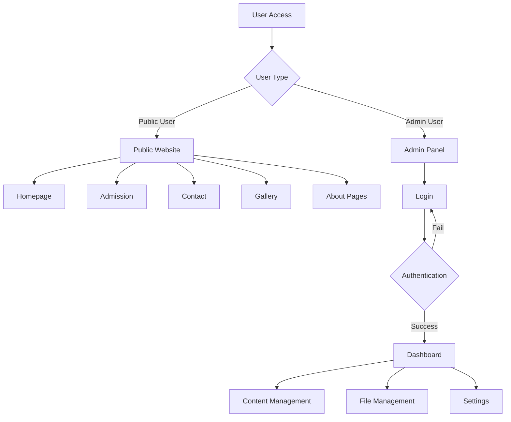

## 🏠 Public Website Flow

### Homepage Navigation Flow
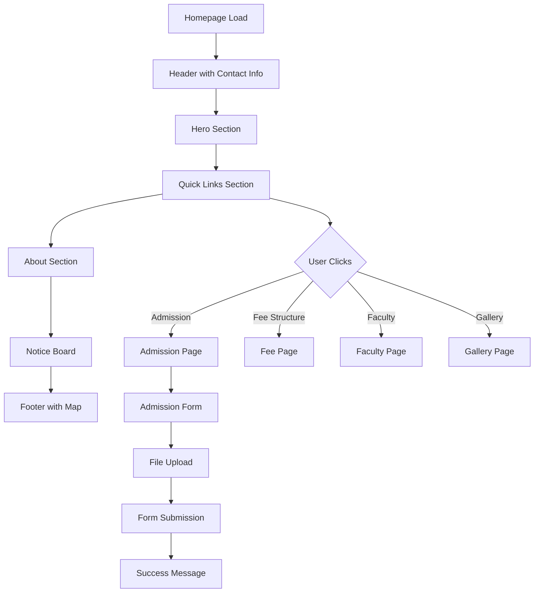

### Contact System Flow
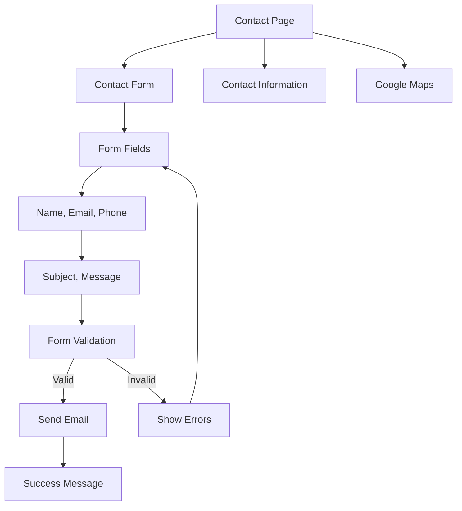

### Gallery System Flow
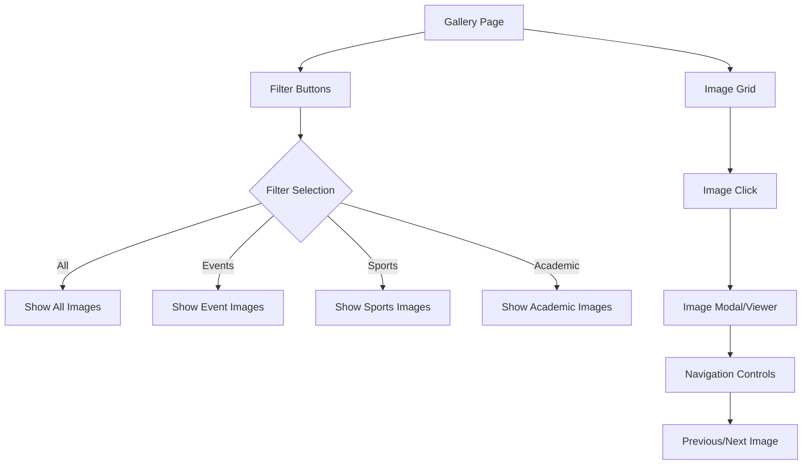

## 🔐 Admin Panel Flow

### Authentication Flow
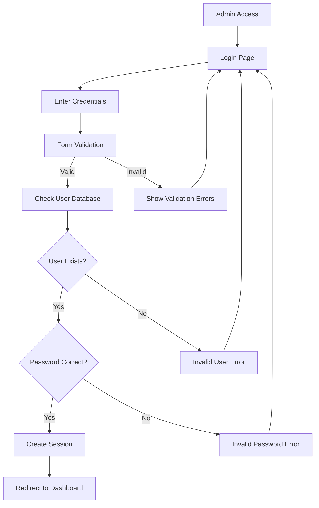

### Dashboard Flow
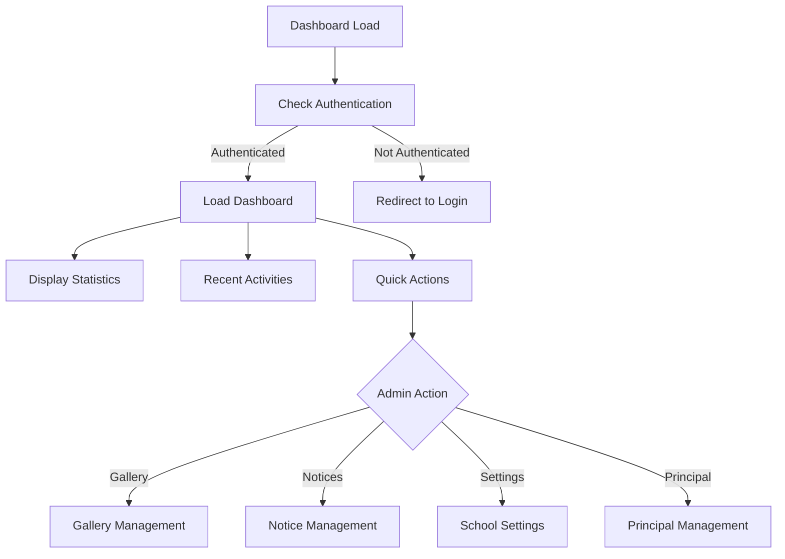

### Content Management Flow
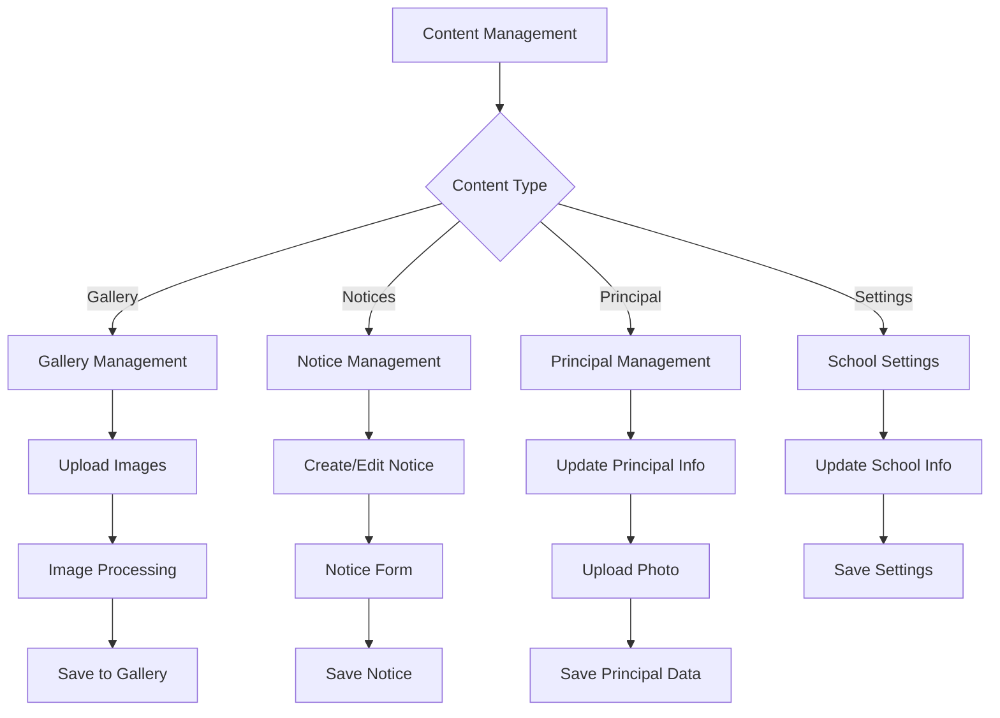

## 📁 File Upload Flow

### Image Upload Process
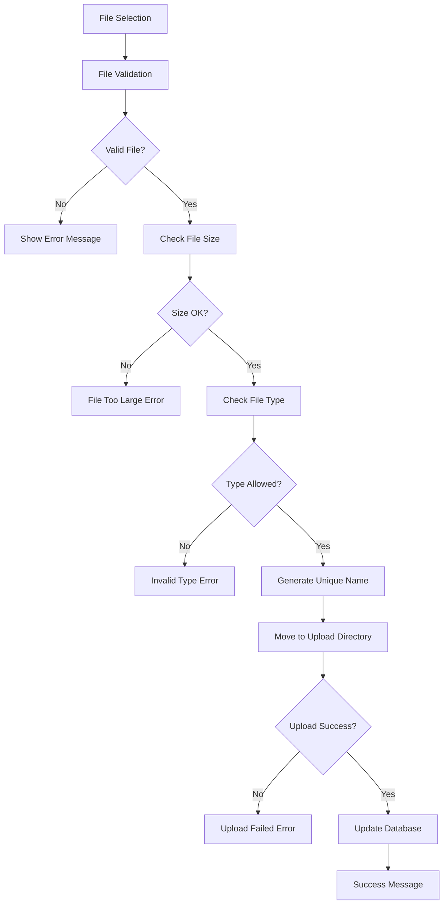

### Document Upload Flow
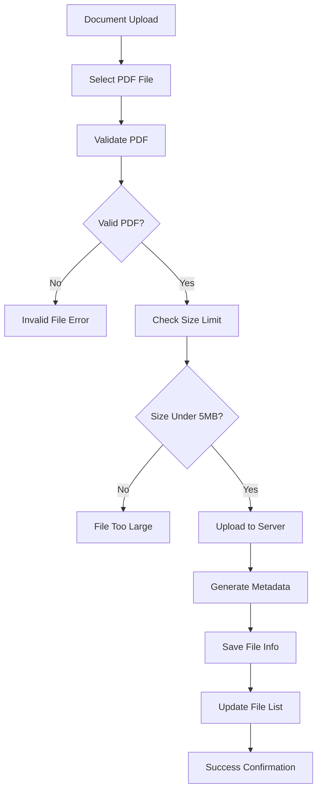

## 🔍 Data Flow Architecture

### Data Storage Flow
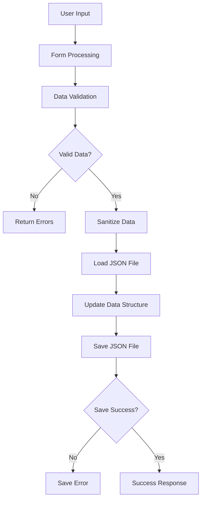

### Settings Management Flow
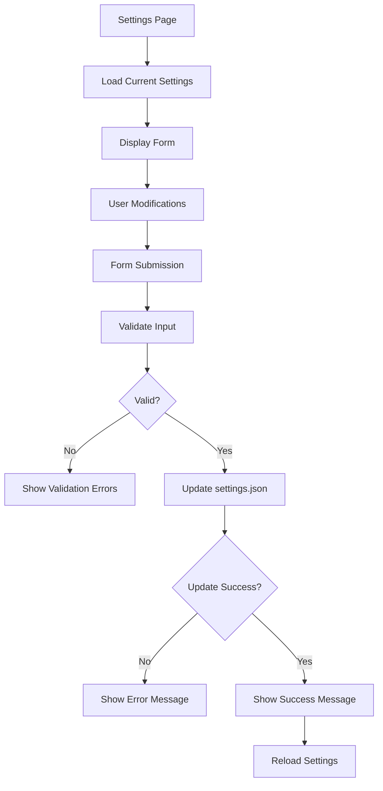

## 🔒 Security Flow

### Session Management Flow
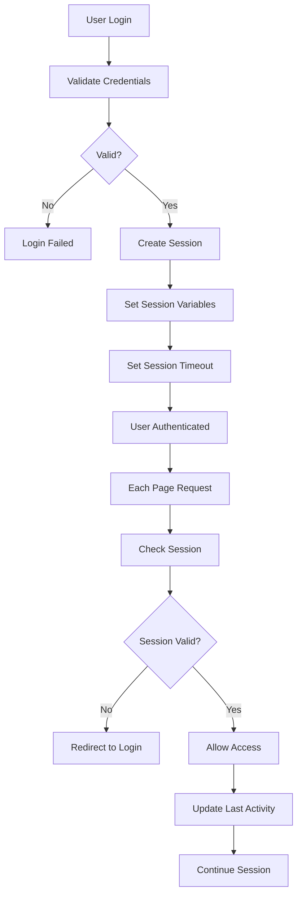

### File Security Flow
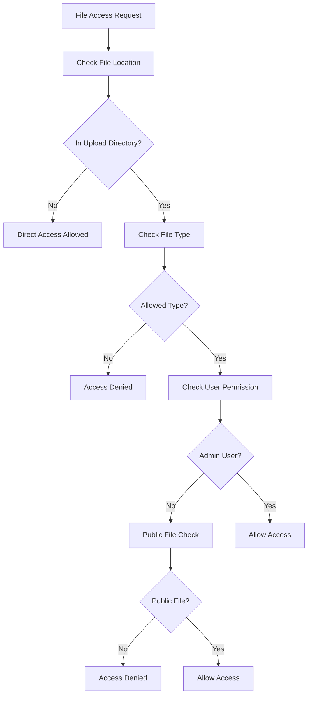

## 📱 Responsive Design Flow

### Device Detection Flow
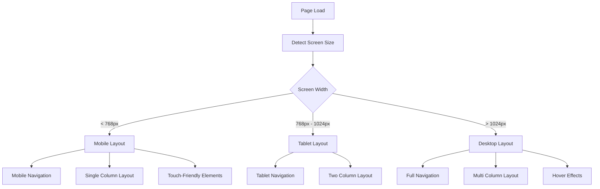

## 🚀 Performance Optimization Flow

### Page Load Optimization
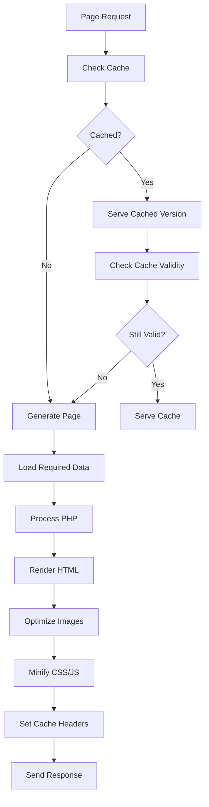

## 📊 Error Handling Flow

### Error Management Flow
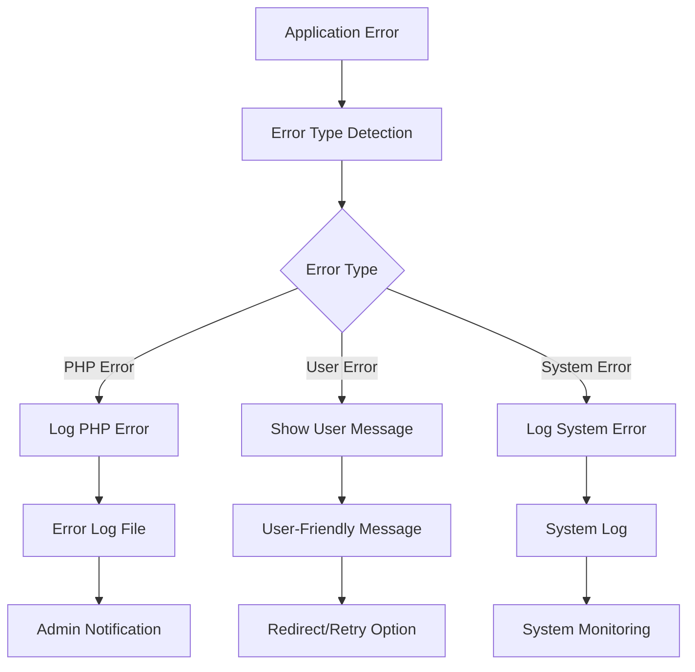

## 🔄 Backup and Recovery Flow

### Backup Process Flow
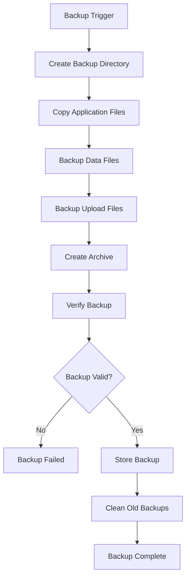

---

This comprehensive flowchart documentation provides visual representation of all major processes and user flows in the NAF Public School website application.
