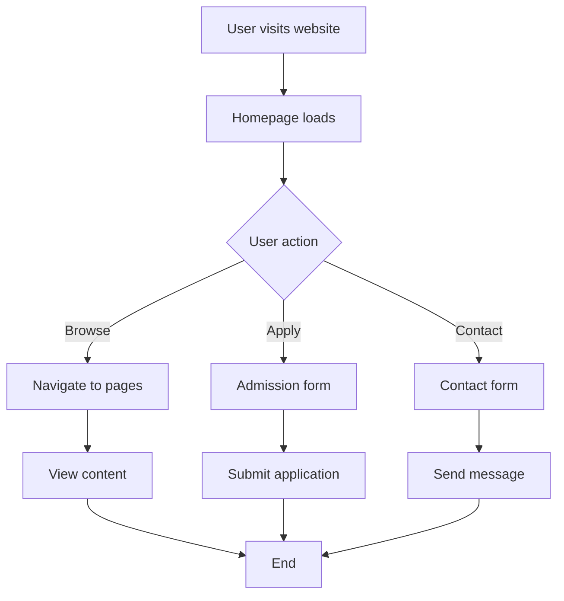
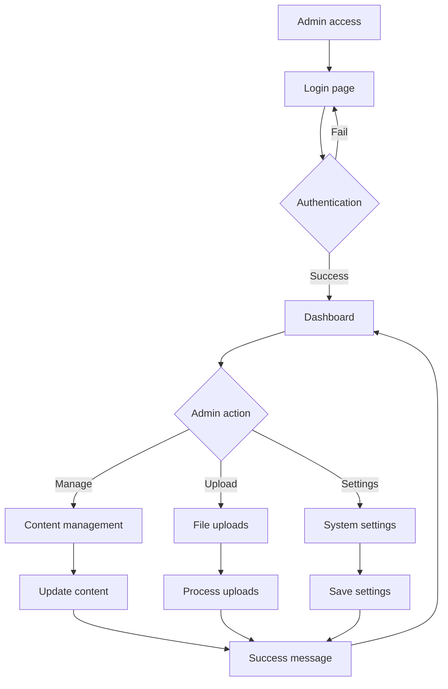

# Technical Documentation - NAF Public School Website

## 🏗️ Architecture Overview

### System Architecture
```
┌─────────────────┐    ┌─────────────────┐    ┌─────────────────┐
│   Frontend      │    │   Backend       │    │   Data Layer    │
│   (HTML/CSS/JS) │◄──►│   (PHP)         │◄──►│   (JSON Files)  │
└─────────────────┘    └─────────────────┘    └─────────────────┘
```

### Technology Stack
- **Frontend**: HTML5, CSS3, JavaScript (ES6+)
- **Backend**: PHP 7.4+
- **Data Storage**: JSON files
- **Web Server**: PHP Built-in Server / Apache / Nginx
- **Version Control**: Git

## 📊 Application Flow

### User Journey - Public Website


### Admin Panel Flow


## 🗂️ File Structure Analysis

### Core Files
| File | Purpose | Dependencies |
|------|---------|--------------|
| `index.php` | Homepage | `includes/header.php`, `includes/footer.php` |
| `admission.php` | Admission info | Header, Footer |
| `admission-form.php` | Application form | Header, Footer, File upload |
| `contact.php` | Contact page | Header, Footer, Google Maps |
| `admin/login.php` | Admin authentication | Session management |
| `admin/dashboard.php` | Admin dashboard | Authentication check |

### Data Files
| File | Content | Format |
|------|---------|--------|
| `data/settings.json` | School information | JSON |
| `data/principal.json` | Principal details | JSON |
| `data/users.json` | Admin users | JSON |
| `data/footer.json` | Footer configuration | JSON |

### Upload Directories
| Directory | Purpose | File Types |
|-----------|---------|------------|
| `uploads/gallery/` | Photo gallery | JPG, PNG, GIF |
| `uploads/notices/` | Notice documents | PDF |
| `uploads/circulars/` | Circular documents | PDF |
| `uploads/applications/` | Admission forms | PDF, DOC |

## 🔧 Core Functions

### Authentication System
```php
// Session-based authentication
function checkAuth() {
    session_start();
    if (!isset($_SESSION['admin_logged_in'])) {
        header('Location: login.php');
        exit;
    }
}

// Login validation
function validateLogin($username, $password) {
    $users = json_decode(file_get_contents('../data/users.json'), true);
    return isset($users[$username]) && 
           $users[$username]['password'] === $password;
}
```

### File Upload System
```php
// Secure file upload
function uploadFile($file, $destination, $allowedTypes) {
    $fileType = strtolower(pathinfo($file['name'], PATHINFO_EXTENSION));
    
    if (!in_array($fileType, $allowedTypes)) {
        return ['success' => false, 'message' => 'Invalid file type'];
    }
    
    if ($file['size'] > 5000000) { // 5MB limit
        return ['success' => false, 'message' => 'File too large'];
    }
    
    $fileName = uniqid() . '.' . $fileType;
    $targetPath = $destination . $fileName;
    
    if (move_uploaded_file($file['tmp_name'], $targetPath)) {
        return ['success' => true, 'filename' => $fileName];
    }
    
    return ['success' => false, 'message' => 'Upload failed'];
}
```

### Data Management
```php
// JSON data operations
function loadData($file) {
    if (file_exists($file)) {
        return json_decode(file_get_contents($file), true);
    }
    return [];
}

function saveData($file, $data) {
    return file_put_contents($file, json_encode($data, JSON_PRETTY_PRINT));
}
```

## 🎨 CSS Architecture

### Design System
```css
/* Color Variables */
:root {
    --primary-blue: #1e3a8a;
    --accent-orange: #f59e0b;
    --background-gray: #f8fafc;
    --text-dark: #333333;
    --text-light: #666666;
}

/* Typography Scale */
.text-xs { font-size: 0.75rem; }
.text-sm { font-size: 0.875rem; }
.text-base { font-size: 1rem; }
.text-lg { font-size: 1.125rem; }
.text-xl { font-size: 1.25rem; }
.text-2xl { font-size: 1.5rem; }
.text-3xl { font-size: 1.875rem; }
```

### Component Styles
```css
/* Card Component */
.card {
    background: white;
    padding: 2rem;
    border-radius: 10px;
    box-shadow: 0 5px 15px rgba(0,0,0,0.1);
    transition: transform 0.3s;
}

.card:hover {
    transform: translateY(-5px);
}

/* Button Component */
.btn {
    background: var(--primary-blue);
    color: white;
    padding: 0.75rem 2rem;
    border: none;
    border-radius: 5px;
    cursor: pointer;
    font-size: 1rem;
    transition: background 0.3s;
}

.btn:hover {
    background: #1e40af;
}
```

### Responsive Grid System
```css
/* Grid System */
.grid {
    display: grid;
    gap: 1rem;
}

.grid-cols-1 { grid-template-columns: repeat(1, 1fr); }
.grid-cols-2 { grid-template-columns: repeat(2, 1fr); }
.grid-cols-3 { grid-template-columns: repeat(3, 1fr); }
.grid-cols-4 { grid-template-columns: repeat(4, 1fr); }

/* Responsive Breakpoints */
@media (max-width: 768px) {
    .grid-cols-2,
    .grid-cols-3,
    .grid-cols-4 {
        grid-template-columns: 1fr;
    }
}
```

## 🔒 Security Implementation

### Input Validation
```php
// Sanitize user input
function sanitizeInput($data) {
    $data = trim($data);
    $data = stripslashes($data);
    $data = htmlspecialchars($data);
    return $data;
}

// Validate email
function validateEmail($email) {
    return filter_var($email, FILTER_VALIDATE_EMAIL);
}

// Validate phone number
function validatePhone($phone) {
    return preg_match('/^[0-9]{10}$/', $phone);
}
```

### File Security
```apache
# .htaccess security rules
<Files "*.json">
    Order allow,deny
    Deny from all
</Files>

<Files "*.log">
    Order allow,deny
    Deny from all
</Files>

# Prevent directory browsing
Options -Indexes

# Security headers
Header always set X-Content-Type-Options nosniff
Header always set X-Frame-Options DENY
Header always set X-XSS-Protection "1; mode=block"
```

### Session Security
```php
// Secure session configuration
ini_set('session.cookie_httponly', 1);
ini_set('session.cookie_secure', 1);
ini_set('session.use_strict_mode', 1);

// Session timeout
function checkSessionTimeout() {
    if (isset($_SESSION['last_activity']) && 
        (time() - $_SESSION['last_activity'] > 1800)) {
        session_unset();
        session_destroy();
        header('Location: login.php');
        exit;
    }
    $_SESSION['last_activity'] = time();
}
```

## 📱 Responsive Design Implementation

### Mobile-First Approach
```css
/* Base styles for mobile */
.container {
    max-width: 100%;
    padding: 0 1rem;
}

.nav-links {
    display: none; /* Hidden on mobile */
}

/* Tablet styles */
@media (min-width: 768px) {
    .container {
        max-width: 768px;
        padding: 0 2rem;
    }
    
    .nav-links {
        display: flex;
    }
}

/* Desktop styles */
@media (min-width: 1024px) {
    .container {
        max-width: 1200px;
    }
}
```

### Touch-Friendly Design
```css
/* Touch targets */
.btn,
.nav-links a,
.card {
    min-height: 44px;
    min-width: 44px;
}

/* Hover states for touch devices */
@media (hover: hover) {
    .card:hover {
        transform: translateY(-5px);
    }
}
```

## 🚀 Performance Optimization

### Image Optimization
```php
// Image compression
function compressImage($source, $destination, $quality) {
    $info = getimagesize($source);
    
    if ($info['mime'] == 'image/jpeg') {
        $image = imagecreatefromjpeg($source);
    } elseif ($info['mime'] == 'image/png') {
        $image = imagecreatefrompng($source);
    }
    
    imagejpeg($image, $destination, $quality);
    imagedestroy($image);
}
```

### Caching Strategy
```php
// Browser caching headers
function setCacheHeaders($seconds = 3600) {
    header('Cache-Control: public, max-age=' . $seconds);
    header('Expires: ' . gmdate('D, d M Y H:i:s', time() + $seconds) . ' GMT');
    header('Last-Modified: ' . gmdate('D, d M Y H:i:s', filemtime(__FILE__)) . ' GMT');
}
```

### Code Minification
```javascript
// JavaScript optimization
(function() {
    'use strict';
    
    // Lazy loading images
    const images = document.querySelectorAll('img[data-src]');
    const imageObserver = new IntersectionObserver((entries, observer) => {
        entries.forEach(entry => {
            if (entry.isIntersecting) {
                const img = entry.target;
                img.src = img.dataset.src;
                img.classList.remove('lazy');
                observer.unobserve(img);
            }
        });
    });
    
    images.forEach(img => imageObserver.observe(img));
})();
```

## 🔍 SEO Implementation

### Meta Tags
```php
// Dynamic meta tags
function generateMetaTags($page) {
    $meta = [
        'title' => 'NAF Public School - Excellence in Education',
        'description' => 'Quality education for bright future',
        'keywords' => 'school, education, admission, NAF Public School'
    ];
    
    switch($page) {
        case 'admission':
            $meta['title'] = 'Admission - NAF Public School';
            $meta['description'] = 'Apply for admission at NAF Public School';
            break;
        case 'contact':
            $meta['title'] = 'Contact Us - NAF Public School';
            $meta['description'] = 'Get in touch with NAF Public School';
            break;
    }
    
    return $meta;
}
```

### Structured Data
```html
<!-- JSON-LD structured data -->
<script type="application/ld+json">
{
    "@context": "https://schema.org",
    "@type": "EducationalOrganization",
    "name": "NAF Public School",
    "address": {
        "@type": "PostalAddress",
        "streetAddress": "Village Khekra",
        "addressLocality": "Baghpat",
        "addressRegion": "Uttar Pradesh",
        "addressCountry": "IN"
    },
    "telephone": "+91-8445030782",
    "email": "info@fampublicschool.com"
}
</script>
```

## 🧪 Testing Strategy

### Manual Testing Checklist
- [ ] All pages load correctly
- [ ] Forms submit successfully
- [ ] File uploads work
- [ ] Admin panel functions
- [ ] Mobile responsiveness
- [ ] Cross-browser compatibility
- [ ] Security measures active

### Performance Testing
```bash
# Load testing with curl
for i in {1..100}; do
    curl -o /dev/null -s -w "%{time_total}\n" http://localhost:3232/
done
```

## 📈 Analytics & Monitoring

### Error Logging
```php
// Custom error logging
function logError($message, $file = 'error.log') {
    $timestamp = date('Y-m-d H:i:s');
    $logMessage = "[$timestamp] $message" . PHP_EOL;
    file_put_contents($file, $logMessage, FILE_APPEND | LOCK_EX);
}

// Usage
try {
    // Code that might fail
} catch (Exception $e) {
    logError("Error: " . $e->getMessage());
}
```

### Activity Tracking
```php
// Admin activity logging
function logActivity($action, $details = '') {
    $log = [
        'timestamp' => date('Y-m-d H:i:s'),
        'user' => $_SESSION['admin_username'] ?? 'unknown',
        'action' => $action,
        'details' => $details,
        'ip' => $_SERVER['REMOTE_ADDR'] ?? 'unknown'
    ];
    
    $logs = loadData('data/activity_log.json');
    $logs[] = $log;
    
    // Keep only last 1000 entries
    if (count($logs) > 1000) {
        $logs = array_slice($logs, -1000);
    }
    
    saveData('data/activity_log.json', $logs);
}
```

## 🔧 Maintenance & Updates

### Backup Strategy
```bash
#!/bin/bash
# backup.sh - Backup script
DATE=$(date +%Y%m%d_%H%M%S)
BACKUP_DIR="backups"
SOURCE_DIR="/path/to/school-wp"

mkdir -p $BACKUP_DIR
tar -czf "$BACKUP_DIR/backup_$DATE.tar.gz" $SOURCE_DIR
echo "Backup created: backup_$DATE.tar.gz"
```

### Update Procedure
1. Backup current installation
2. Test updates in staging environment
3. Deploy updates to production
4. Verify functionality
5. Monitor for issues

---

This technical documentation provides comprehensive details about the NAF Public School website architecture, implementation, and maintenance procedures.
